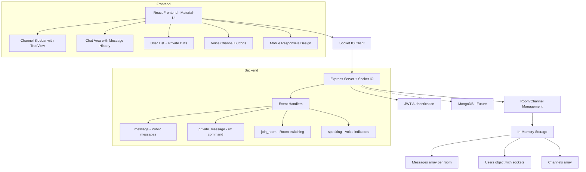

# Chat-JS

Реал-тайм чат приложение в стиле Discord, разработанное на React (frontend) и Node.js с Socket.IO (backend).

## Архитектура

Текущая архитектура приложения (актуальная на 2025 год):



### Обзор архитектуры
- **Frontend**: React приложение с Material-UI и темной темой Discord-style. Полностью адаптивное, включая мобильную версию с Drawer.
- **Backend**: Express + Socket.IO сервер с in-memory хранением. JWT аутентификация.
- **Коммуникация**: WebSocket для реал-тайма, HTTP для каналов и аутентификации.
- **Функции**: Каналы (текст/голос), приватные сообщения, индикаторы речи, история сообщений.
- **Будущее**: Переход на MongoDB для персистентности, Redis для масштабирования.

### Ключевые возможности
- **Аутентификация**: Простая JWT система с ролевой моделью (member/admin)
- **Каналы**: Текстовые и голосовые каналы, создание новых через UI
- **Приватные сообщения**: Команда `/w nickname текст`
- **История сообщений**: Загрузка последних сообщений при входе
- **Мобильная адаптация**: Drawer меню для мобильных устройств
- **Индикаторы**: Онлайн статус пользователей, индикаторы речи

### Текущее состояние
- ✅ Базовый функционал работает
- ✅ In-memory хранение (данные теряются при перезапуске)
- ❌ Нет персистентной базы данных
- ❌ Отсутствует полноценная регистрация/вход
- ❌ Voice функционал только UI заглушки

## Стек технологий

### Backend
- **Node.js** + **Express** - HTTP сервер
- **Socket.IO** - WebSocket коммуникация
- **JWT** - аутентификация
- **Mongoose** (готов для подключения MongoDB)
- **CORS** - cross-origin requests

### Frontend
- **React 19** + **Material-UI** - UI фреймворк
- **Socket.IO Client** - WebSocket клиент
- **Axios** - HTTP запросы
- Адаптивный дизайн (mobile-first)

## Структура проекта

```
chat-js/
├── backend/
│   ├── package.json
│   └── server.js          # Сервер Socket.IO
├── frontend/
│   ├── package.json
│   ├── src/
│   │   ├── App.js        # Главный компонент
│   │   ├── App.css
│   │   └── ...
│   └── public/
└── README.md
```

## Быстрый запуск

1. **Клонируйте репозиторий:**
   ```bash
   git clone <repository-url>
   cd chat-js
   ```

2. **Установите зависимости:**
   - Backend: `cd backend && npm install`
   - Frontend: `cd frontend && npm install`

3. **Запустите приложение:**
   - Backend: `cd backend && node server.js` (порт 3001)
   - Frontend: `cd frontend && npm start` (порт 3000)

4. **Откройте браузер:**
   - Перейдите на http://localhost:3000
   - Введите nickname (например, User1)
   - Присоединитесь к каналу General

## Тестирование функций

- Откройте несколько вкладок для тестирования чата
- Создавайте новые каналы через UI
- Используйте `/w nickname сообщение` для приватных сообщений
- Тестируйте мобильную версию

## Переменные окружения

Создайте `.env` файлы для конфиденциальных данных (будущая задача).

## Дальнейшее развитие

Подробный план развития см. в [TODO.md](TODO.md).
Основные направления:
- Добавление MongoDB для персистентности
- Полноценная система аутентификации
- WebRTC для голосового общения
- Тестирование и CI/CD
- Масштабирование

## Автор

Проект разработан в 2025 году.
