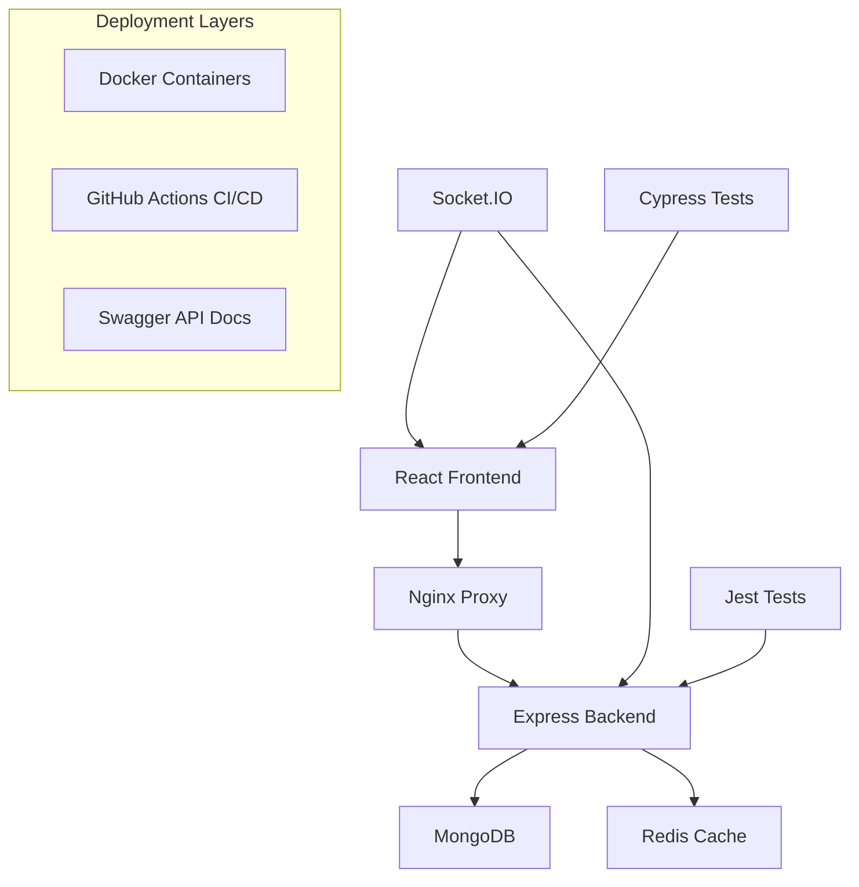

# Architecture Diagram

## Component Structure

### Backend
- `server.js`: Main entry point
- `models/`: Database models
- `services/`: Business logic
- `tests/`: Test suites

### Frontend
- `src/components/`: React components
- `src/hooks/`: Custom hooks
- `cypress/`: E2E tests
- `public/`: Static assets
